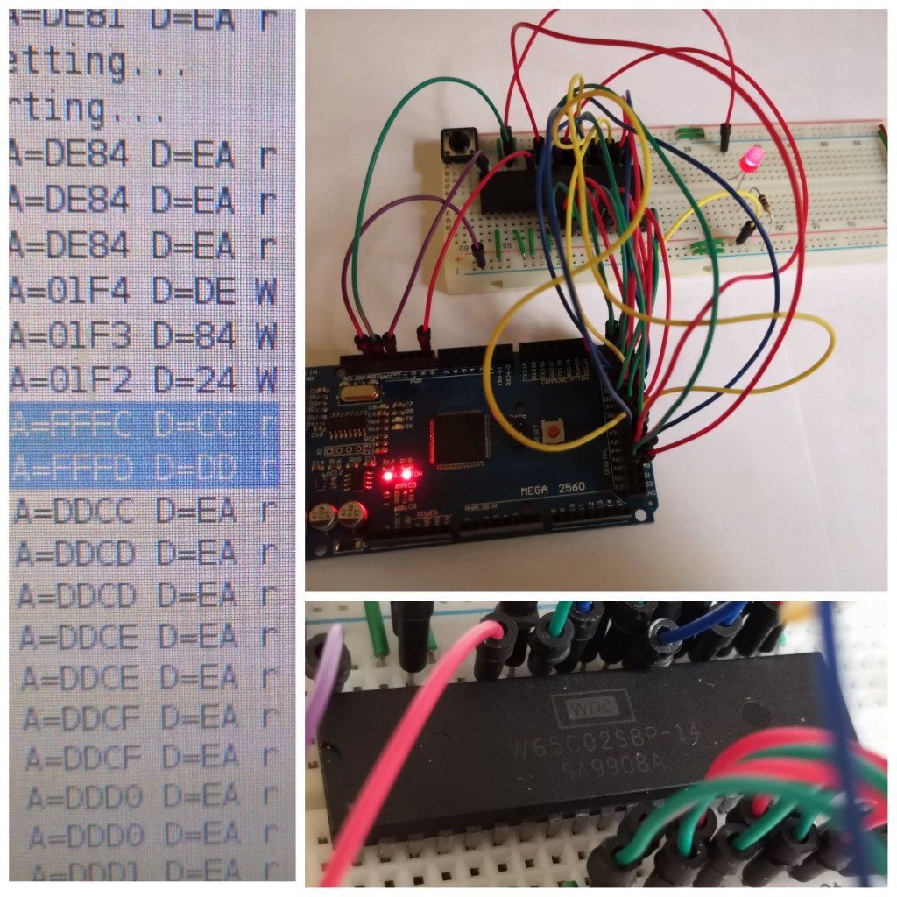
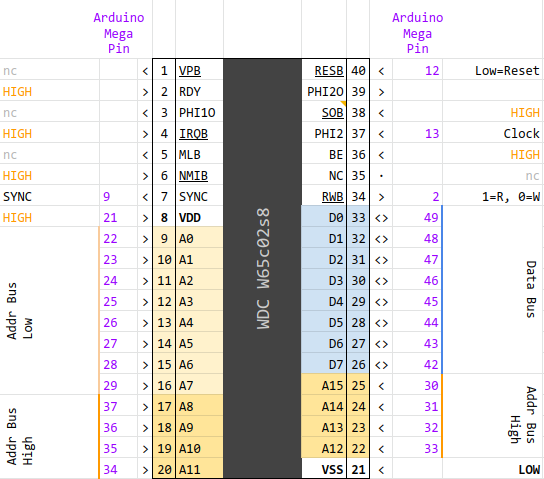

# 6502 CPU driven by an Arduino Mega

- [6502 CPU driven by an Arduino Mega](#6502-cpu-driven-by-an-arduino-mega)
- [Introduction](#introduction)
- [Pin Mappings](#pin-mappings)
- [Disassembling on the fly](#disassembling-on-the-fly)
  - [Example of `serialHost.py` output](#example-of-serialhostpy-output)
- [Credits](#credits)
- [Reference](#reference)



# Introduction

This project is about experimenting with a hardcore 6502 processor. Concretely, I'm using a WDC w65c02s8, bought from Ali Express. It was made in 1999... so it's 21 years old, but it seems working.

The processor is driven by an Arduino Mega, which provides:
- a clock signal
- a ROM
- a RAM

The ROM is embedded into the Arduino sketch, as `rom.h` file. It is made by assembling the source code using CC65 suite and converted to a C array using xxd.

The Arduino Mega also serves as a logic analyser, and dumps the Address bus, Data bus, and some control signals (RWB, SYNC) to its serial port.

In addition, a program is provided to further analyse the serial transmission on the computer attached to the Arduino Mega. At the moment, this disassembles the running instructions.

# Pin Mappings

This diagrams shows the pin mapping between the Arduino Mega pins and the 6502 pins.



# Disassembling on the fly

The [disassemble/serialHost.py](disassemble/serialHost.py) Python scripts reads the serial output from the Arduino Mega, and tries to disassemble it on the fly.

It will build the instructions byte per byte, as they are coming.

## Example of `serialHost.py` output

The program being run in this example is the following loop:

```
LF000:  lda     $2000                           ; F000 AD 00 20
        sta     $2000                           ; F003 8D 00 20
        jmp     LF000                           ; F006 4C 00 F0

```

At the time of running this:
- when the 6502 is reading from $2000, the Mega will send the byte value of Pin Port F (Register PINF)
- when writing to $2000, the Mega will write to Pin Port K (Register PORTK)

So the program is continuously copying PINF into PORTK of the Arduino Mega, in other works, it's reading the logic level of the 8 pins of port F, and setting the logic level of the 8 pins of port K to be the same.

Let's see the output of `serialHost.py` in this case. The first column (before the `|` is the output from Arduino Mega). After the `|` is the decoding.

```
EF85 00 r 1 | ef85  00           brk              SNGL 
EF85 00 r 0 |                                     Not an instruction
01CA 00 W 0 |                                     Not an instruction
01C9 00 W 0 |                                     Not an instruction
01C8 00 W 0 |                                     Not an instruction
FFFC 00 r 0 |                                     Not an instruction
FFFD F0 r 0 |                                     Not an instruction
F000 AD r 1 | f000  AD .. ..     lda $....        ABS  
F001 00 r 0 | f000  AD 00 ..     lda $..00        ABS  
F002 20 r 0 | f000  AD 00 20     lda $2000        ABS  
2000 80 r 0 |                                     Not an instruction
F003 8D r 1 | f003  8D .. ..     sta $....        ABS  
F004 00 r 0 | f003  8D 00 ..     sta $..00        ABS  
F005 20 r 0 | f003  8D 00 20     sta $2000        ABS  
2000 20 W 0 |                                     Not an instruction
F006 4C r 1 | f006  4C .. ..     jmp $....        ABS  
F007 00 r 0 | f006  4C 00 ..     jmp $..00        ABS  
F008 F0 r 0 | f006  4C 00 F0     jmp $F000        ABS  
F000 AD r 1 | f000  AD .. ..     lda $....        ABS  
F001 00 r 0 | f000  AD 00 ..     lda $..00        ABS  
F002 20 r 0 | f000  AD 00 20     lda $2000        ABS  
2000 80 r 0 |                                     Not an instruction
F003 8D r 1 | f003  8D .. ..     sta $....        ABS  
F004 00 r 0 | f003  8D 00 ..     sta $..00        ABS  
F005 20 r 0 | f003  8D 00 20     sta $2000        ABS  
2000 20 W 0 |                                     Not an instruction
F006 4C r 1 | f006  4C .. ..     jmp $....        ABS  
F007 00 r 0 | f006  4C 00 ..     jmp $..00        ABS  
F008 F0 r 0 | f006  4C 00 F0     jmp $F000        ABS  
```

Notice how bytes are replaced by ".." when the instruction is incomplete, and they are filling in progressively to decode the complete instruction.

# Credits

Here are some awesome projects. From some of them I have taken inspiration, from others I have copied lines of code.

- [Build a 6502 computer | Ben Eater](https://eater.net/6502): This is definitely what started all this.
- [Retroshield for Arduino Mega | 8 Bit Force](http://www.8bitforce.com/projects/retroshield/)
  - [RetroShield 6502 Operation](http://www.8bitforce.com/blog/2019/03/12/retroshield-6502-operation/)
  - [RetroShield Arduino Code](https://gitlab.com/8bitforce/retroshield-arduino)
- My disassembler "logic" started inspired by skilldrick's disassembler in [Easy 6502](https://skilldrick.github.io/easy6502/)
- I've learned a lot by looking at olivierjan's 6502's routines in his [ROM-software-for-6502-SBC](https://github.com/olivierjan/ROM-software-for-6502-SBC)

# Reference

- [W65c02s Datasheet, February 2004](http://datasheets.chipdb.org/Western%20Design/W65C02S.pdf)
- [W65c02s Datasheet, February 2020](https://www.westerndesigncenter.com/wdc/documentation/w65c02s.pdf)
